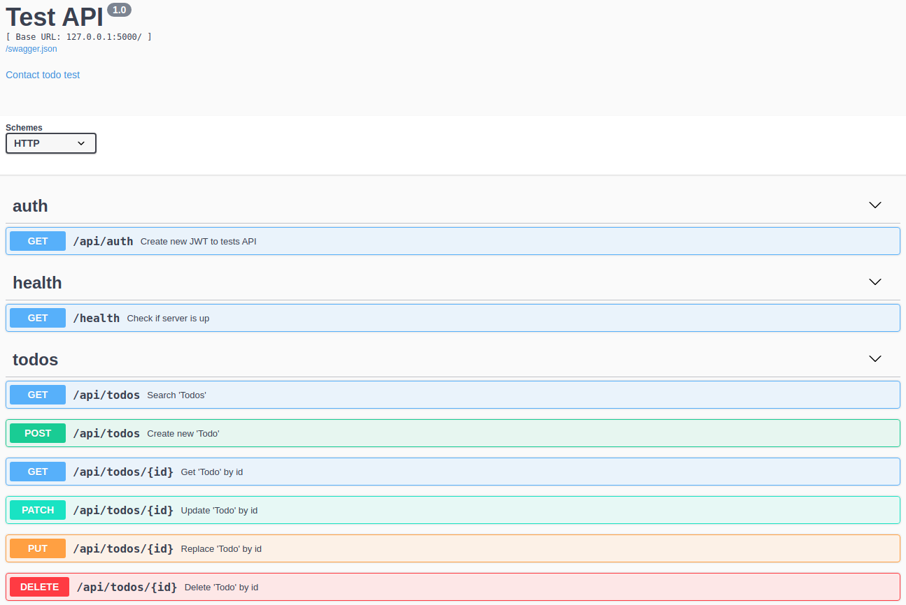
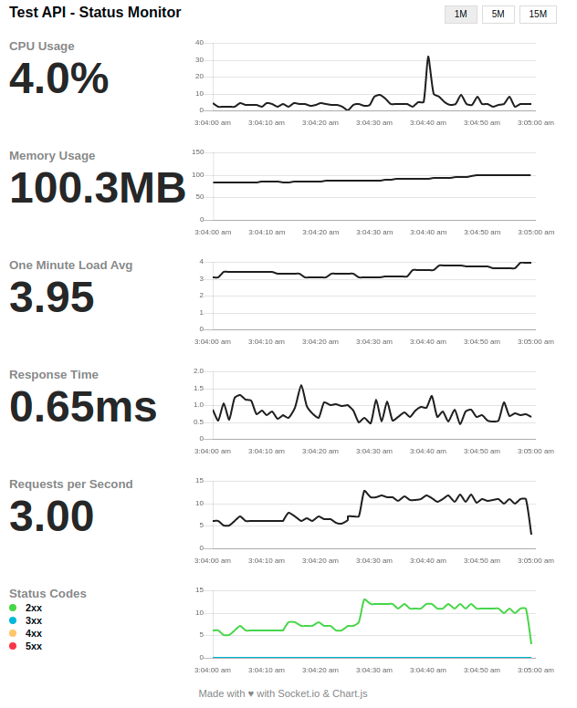

### xHelpers API

[](https://www.npmjs.com/package/xhelpers-api)


[](http://forthebadge.com) [](http://forthebadge.com)[](http://forthebadge.com)

[](http://makeapullrequest.com)[](https://github.com/sindresorhus/awesome)

## Description

This project was made for personal use, it should simplify the process of creating an new api using node js + typescript + database (Mongoose/Sequelize).

### Stack

- [TypeScript 3.8](https://www.typescriptlang.org/).
- [Node.js 12+](https://nodejs.org/).
- [Mongoose 5.7](https://mongoosejs.com/).
  - [Mongodb](https://www.mongodb.com/).
- [Sequelize 5.21](https://sequelize.org/).
  - [MySQL](https://www.mysql.com/).
  - [MariaDB](https://mariadb.org/).
  - [SQLite](https://www.sqlite.org/index.html).
  - [Microsoft SQL Server](https://www.microsoft.com/pt-br/sql-server/sql-server-2019).  
  - [PostgreSQL](https://www.postgresql.org/).
- [Hapi 19.0](https://hapi.dev/).
- [JWT](https://github.com/dwyl/hapi-auth-jwt2).
- [SSO bell](https://github.com/hapijs/bell).
- [Hapi-swagger](https://github.com/glennjones/hapi-swagger).

## Versions

- ➕ 2.1.0 - New authorization mode 'appkey'.
  - [feature] Added basic auth appkey mode [#3](/../../issues/3)
- 🔥 2.0.0 - New version (breaking change)
  - Upgraded packages to @hapi/
  - Added tests
  - Added default route /status using 'hapijs-status-monitor'
- ➕ 1.1.0 - Fixed some bugs on JWT auth.
- ➕ 1.0.\* - alot of mixed code

## Roadmap

- 🔥 Add tests for each base service !!
- ➕ Create grapql base service
- Improve documentation
- Add more samples

## Installation

```bash
$ npm i xhelpers-api
```

### Hapi Server

Basics "createServer" method:

```code
Signature:
createServer({ serverOptions, options }:
{
  serverOptions: {
    port: number;
    host: string;
  };
  options: {
    app_key_auth?: string;
    jwt_secret?: string;
    swaggerOptions?: hapi-swagger.RegisterOptions;
    routeOptions: {
      routes: string;
    };
    mongooseOptions?: {
      uri: string;
      connectionOptions: mongoose.ConnectionOptions;
    };
    sequelizeOptions?: sequelize-typescript.SequelizeOptions;
    enableSSL: boolean;
    enableSSO: boolean;
    ssoCallback: Function;
  };
}): Hapi.Server
```

#### Usage

```code
import { createServer } from "xhelpers-api/lib/server";
const pkgJson = require("../package.json");

let server: any = {};
async function start() {
  const serverOptions: any = {
    port: 5000,
    host: process.env.HOST || "127.0.0.1",
  };
  const options: any = {
    jwt_secret: "v3ryH4Rds3cr3t",
    swaggerOptions: {
      info: {
        title: "Test API",
        version: "1.0",
        contact: {
          name: "todo test",
          email: "tester@test.com",
        },
      },
      schemes: [process.env.SSL === "true" ? "https" : "http"],
      grouping: "tags",
    },
    routeOptions: {
      routes: "**/routes/*.js",
    }
  };
  server = await createServer({ serverOptions, options });
  await server.start();
}
start();
```

#### Output

```code
Starting Xhelpers Hapi server API
Settings API: Mongoose disabled;
Settings API: Sequelize disabled;
Settings API: SSL disabled;
Settings API: AppKey disabled;
Settings API: JWT enabled;
Settings API: SSO disabled;
====================================================================================================
🆙  Server api    : http://127.0.0.1:5000/
🆙  Server doc    : http://127.0.0.1:5000/documentation
🆙  Server status : http://127.0.0.1:5000/status
====================================================================================================
Routing table:
        🔎  get -         /documentation
        🔎  get -         /health
        🔎  get -         /status
        🔎  get -         /swagger.json
        🔎  get -         /api/auth
        🔎  get -         /api/todos
        🔎  get -    🔑   /api/todos/{id}
        📄  post -        /api/todos
        📝  patch -  🔑   /api/todos/{id}
        📝  put -    🔑   /api/todos/{id}
        🚩  delete - 🔑   /api/todos/{id}
====================================================================================================
```

## Default Routes

```code
🆙  Server doc    : http://127.0.0.1:5000/documentation
🆙  Server status : http://127.0.0.1:5000/status
```

### Swagger /documentation



### Status



### Routes

```code
import * as Joi from "@hapi/joi";
import * as jwt from "jsonwebtoken";

import BaseRouteSimple from "xhelpers-api/lib/base-route-simple";

const httpResourcePath = "todos";

class TodoRoutes extends BaseRouteSimple {
  constructor() {
    super([httpResourcePath]);

    this.route("GET",`/api/auth`, {
        description: "Create new JWT to tests API",
        tags: ["api", "auth"],
      },
      false)
      .handler(async (r, h, u) => {
        const token = jwt.sign({ user: { id: "99999" } },
          "v3ryH4Rds3cr3t",
          {
            issuer: "ApiTesterIssuer",
            expiresIn: "2h",
          }
        );
        return h.response({ token: token }).code(200);
      })
      .build();

    this.route("GET",`/api/${httpResourcePath}`,{
        description: "Search 'Todos'",
      },
      false
    )
      .validate({ query: todoDemoPayload })
      .handler(async (r, h, u) => {
        return h.response([r.query]).code(200);
      })
      .build();

    this.route("GET", `/api/${httpResourcePath}/{id}`, {
      description: "Get 'Todo' by id",
    })
      .validate({ params: this.defaultIdProperty })
      .handler(async (r, h, u) => {
        return h.response(r.params).code(200);
      })
      .build();

    this.route("POST", `/api/${httpResourcePath}`, {
        description: "Create new 'Todo'",
      },
      false
    )
      .validate({ payload: todoDemoPayload })
      .handler(async (r, h, u) => {
        return h.response(r.payload).code(200);
      })
      .build();

    this.route("PATCH", `/api/${httpResourcePath}/{id}`, {
      description: "Update 'Todo' by id",
    })
      .validate({ params: this.defaultIdProperty, payload: todoDemoPayload })
      .handler(async (r, h, u) => {
        return h
          .response({
            ...r.params,
            ...(r.payload as {}),
          })
          .code(200);
      })
      .build();

    this.route("PUT", `/api/${httpResourcePath}/{id}`, {
      description: "Replace 'Todo' by id",
    })
      .validate({ params: this.defaultIdProperty, payload: todoDemoPayload })
      .handler(async (r, h, u) => {
        return h
          .response({
            ...r.params,
            ...(r.payload as {}),
          })
          .code(200);
      })
      .build();

    this.route("DELETE", `/api/${httpResourcePath}/{id}`, {
      description: "Delete 'Todo' by id",
    })
      .validate({ params: this.defaultIdProperty })
      .handler(async (r, h, u) => {
        return h
          .response({
            ...r.params,
          })
          .code(200);
      })
      .build();
  }
}

// ****
// Validation Joi
const todoDemoPayload = Joi.object({
  title: Joi.string()
    .required()
    .description("Title"),
  description: Joi.string()
    .required()
    .description("Description"),
  done: Joi.boolean()
    .required()
    .default(false)
    .description("Todo is done"),
})
  .description("Todo payload")
  .label("TodoPayload");

module.exports = [...new TodoRoutes().buildRoutes()];
```

### Service

```code
//contract
export interface IBaseService {
  queryAll(
    user: any,
    filter: any,
    pagination: {
      offset: number;
      limit: number;
      sort: any;
    },
    populateOptions?: {
      path: string | any;
      select?: string | any;
    }
  ): Promise<any[]>;
  getById(
    user: any,
    id: any,
    projection: any,
    populateOptions?: {
      path: string | any;
      select?: string | any;
    }
  ): Promise<any>;
  create(user: any, payload: any): Promise<any>;
  update(user: any, id: any, payload: any): Promise<any>;
  delete(user: any, id: any): Promise<void>;
}
```

```code
import AccountLogin from "/model/account_login"; // mongoose or sequelize "Model"
import BaseServiceSequelize from "xhelpers-api/lib/base-service-sequelize";
import BaseServiceMongoose from "xhelpers-api/lib/base-service-mongoose";

// mongoose
export class AccountLoginService extends BaseServiceMongoose<
  AccountLogin
> {
  constructor() {
    super(AccountLogin);
  }
  sentitiveInfo: any = ["-__v", "password"];
  protected async validate(entity: AccountLogin, payload: AccountLogin): Promise<boolean> {
    const invalid = false;
    if (invalid) throw new Error("Invalid payload.");
    return Promise.resolve(true);
  }
}

// sequelize
export class AccountLoginSqlService extends BaseServiceSequelize<
  AccountLogin
> {
  constructor() {
    super(AccountLogin);
  }
  sentitiveInfo: any = ["id"];
  protected async validate(
    entity: AccountLogin,
    payload: AccountLogin
  ): Promise<boolean> {
    const invalid = false;
    if (invalid) throw new Error("Invalid payload.");
    return Promise.resolve(true);
  }
}
```

### Models - Mongoose / Sequelize

### Mongoose: account_login

```code
import * as mongoose from 'mongoose';

export interface AccountLogin extends mongoose.Document {
  ip_number: string;
  browser: string;
  created_at: Date;
}

const schema = new mongoose.Schema({
  ip_number: { type: String , required: true},
  browser: { type: String },
  created_at: { type: Date, required: true },
});

schema.set('toJSON', { virtuals: true });

export default mongoose.model<AccountLogin>('AccountLogin', schema, 'account_login');
```

### Sequelize: account_login

```code
import {
  BelongsTo,
  Column,
  CreatedAt,
  ForeignKey,
  Model,
  Scopes,
  Table
} from "sequelize-typescript";

@Scopes(() => ({}))
@Table({ tableName: "account_login", updatedAt: false })
export default class AccountLogin extends Model<AccountLogin> {
  @Column
  ip_number: string;
  @Column
  browser: string;
  /* auto */
  @CreatedAt
  @Column
  created_at: Date;
}
```

### Sequelize: Using parameters in route "queryAll"

```
?
fields=
&offset=
&limit=
&sort=[["", "ASC|DESC"]]
&filter={"":""}
```

- **fields**: Select the existing fields in model, comma separeted.

- **offset**: To skip lines before starting to return the lines.

  > OFFSET 0 is the same as omitting the OFFSET parameter

- **limit**: If the limit is specified, no more than this number of lines will be returned.

  > When using LIMIT it is important to use the SORT parameter to establish a single order for the result lines

- **filter**: Select the existing fields in model and values filter, based in JSON.

  > Example: filter=[{"field name":, "field value"}]
  >
  > Template based on sequelize: [Applyng where clauses](https://sequelize.org/master/manual/model-querying-basics.html#applying-where-clauses)

- **sort**: Select the existing fields in the model to order the result, based in JSON.

  > Example: sort=[["field name": "ASC|DESC"]]
  >
  > Template based on sequelize: [Ordering and grouping](https://sequelize.org/master/manual/model-querying-basics.html#ordering-and-grouping)

## Building

```bash
# build tsc
$ npm run build
```

## Test

```bash
$ npm run test
```

#### Output

```bash
  🚧  Testing API Health  🚧
1589087475331 info server started at: http://127.0.0.1:5005
    Health API
[2020-05-10T05:11:15.354Z] GET http://127.0.0.1:5005/documentation 200 (19 ms) {}
      ✓ /documentation should return 200
[2020-05-10T05:11:15.358Z] GET http://127.0.0.1:5005/health 200 (1 ms) {}
      ✓ /health should return 200
[2020-05-10T05:11:15.360Z] GET http://127.0.0.1:5005/status 200 (1 ms) {}
      ✓ /status should return 200
1589087475361 info server stopped at: http://127.0.0.1:5005

  🚧  Resource api/todos  🚧
1589087476139 info server started at: http://127.0.0.1:5005
    API api/todos
[2020-05-10T05:11:16.142Z] POST http://127.0.0.1:5005/api/auth 404 (1 ms) {}
      ✓ POST api/auth - should return 404 not found
[2020-05-10T05:11:16.148Z] GET http://127.0.0.1:5005/api/auth 200 (4 ms) {}
      ✓ GET api/auth - should return 200 with new token
[2020-05-10T05:11:16.153Z] POST http://127.0.0.1:5005/api/todos 200 (4 ms) {"title":"Test TODO","description":"Description of my todo","done":false}
      ✓ POST api/todos - should return 200 with new resource created
[2020-05-10T05:11:16.157Z] POST http://127.0.0.1:5005/api/todos 400 (2 ms) {"title":"","description":"Description of my todo","done":false}
      ✓ POST api/todos - should return 400 and inform that the title is required
[2020-05-10T05:11:16.159Z] POST http://127.0.0.1:5005/api/todos 400 (1 ms) {"title":"Test TODO","description":"","done":false}
      ✓ POST api/todos - should return 400 and inform that the description is required
[2020-05-10T05:11:16.164Z] PATCH http://127.0.0.1:5005/api/todos/99100 200 (4 ms) {"title":"Test TODO","description":"Description of my todo","done":false}
      ✓ PATCH api/todos/{id} - should return 200 with modified resource
[2020-05-10T05:11:16.167Z] PATCH http://127.0.0.1:5005/api/todos/99100 400 (2 ms) {"title":"Test TODO","description":"Description of my todo","done":false,"something":true}
      ✓ PATCH api/todos/{id} - should return 400 with not allowed keys message
[2020-05-10T05:11:16.171Z] PATCH http://127.0.0.1:5005/api/todos/99100 401 (1 ms) {}
      ✓ PATCH api/todos/{id} - should return 401 unauthorized
[2020-05-10T05:11:16.174Z] GET http://127.0.0.1:5005/api/todos?title=test&description=terr&done=false 200 (2 ms) {}
      ✓ GET api/todos - should return 200 with one row
[2020-05-10T05:11:16.177Z] DELETE http://127.0.0.1:5005/api/todos/99100 200 (2 ms) {}
      ✓ DELETE api/todos/{id} - should return 200
[2020-05-10T05:11:16.178Z] DELETE http://127.0.0.1:5005/api/todos/99100 401 (0 ms) {}
      ✓ DELETE api/todos/{id} - should return 401 unauthorized
1589087476179 info server stopped at: http://127.0.0.1:5005


  14 passing (2s)
```

## Support

[Pending]

## Stay in touch

- Author - [wmkdev](https://github.com/wmkDev)

## License
